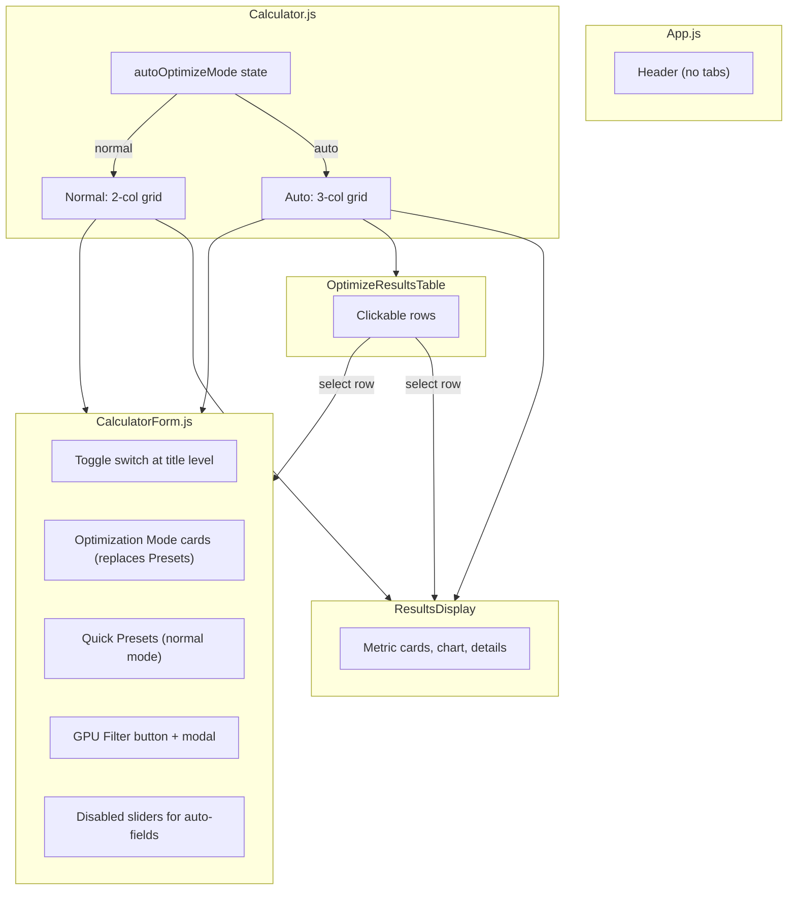
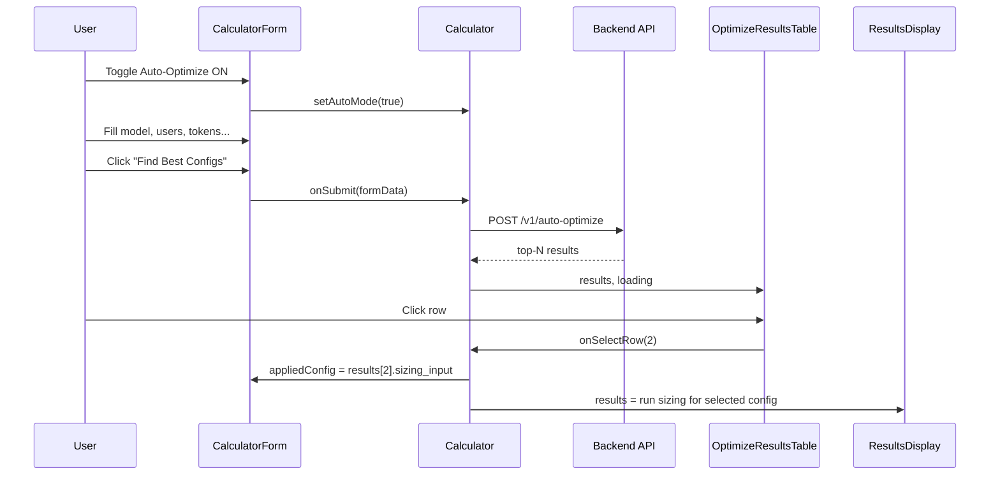

# Рефакторинг UI Auto-Optimize: из отдельной страницы в режим переключения

## Текущая архитектура

```
App.js  --->  [Calculator | Auto-Optimize]  (tabs в хедере)
                   |              |
           Calculator.js    AutoOptimize.js  (отдельный компонент со своей формой)
            /        \
  CalculatorForm   ResultsDisplay
  (2-column grid)
```

## Новая архитектура




## Изменения по файлам

### 1. App.js -- убрать верхние табы

- Удалить `activePage`, `appliedConfig`, `handleApplyConfig` состояния
- Удалить импорт `AutoOptimize`
- Удалить блок с кнопками "Calculator" / "Auto-Optimize" из хедера
- Вернуть просто `<Calculator />` без props
- Файл `AutoOptimize.js` оставим (не удаляем), но он больше не импортируется

### 2. Calculator.js -- центральный хаб

Это теперь главный контроллер режима. Новые состояния:

```js
const [autoMode, setAutoMode] = useState(false);
const [optimizeMode, setOptimizeMode] = useState('balanced');
const [optimizeResults, setOptimizeResults] = useState(null);  // массив результатов
const [selectedConfigIdx, setSelectedConfigIdx] = useState(null);  // индекс выбранной строки
const [optimizeLoading, setOptimizeLoading] = useState(false);
const [gpuFilter, setGpuFilter] = useState([]);  // массив выбранных GPU IDs
```

**Лейаут:**

- Обычный режим: `grid-cols-1 lg:grid-cols-2` -- [Form | Results]
- Авто режим: `grid-cols-1 lg:grid-cols-3` -- [Form | Table | Results]

**Логика:**

- При включении авто-режима: кнопка "Calculate" в форме вызывает `autoOptimize()` API вместо `calculateServerRequirements()`
- При выборе строки в таблице: обновляются `formData` (через callback) и `results` (из `sizing_input` строки + запуск `calculateServerRequirements` с этим input)
- Всё это передаётся через props в дочерние компоненты

### 3. CalculatorForm.js -- адаптация формы

Новые props:

```js
const CalculatorForm = ({
  onSubmit, loading,
  autoMode, setAutoMode,       // переключатель режима
  optimizeMode, setOptimizeMode, // режим оптимизации
  gpuFilter, onOpenGpuFilter,  // GPU фильтр
  appliedConfig, onAppliedConfigConsumed,
}) => { ... }
```

**Изменения в рендере:**

- **Заголовок** (строка ~975): Рядом с "Configuration Parameters" -- toggle-switch с иконкой молнии, тултипом "Auto-Optimize: automatically find the best hardware configuration" и `transition` анимацией. Примерный вид:
  ```
  Configuration Parameters  [===O] Auto-Optimize (i)
  ```
- **Presets / Mode cards** (строка ~978-993): Условный рендер:
  - `!autoMode` -> Quick Presets (как сейчас)
  - `autoMode` -> 4 карточки режимов оптимизации (min_servers, min_total_gpus, balanced, max_performance). Код карточек берём из `AutoOptimize.js`, они уже реализованы. Выбранный режим управляется через `optimizeMode`/`setOptimizeMode`.
- **Заблокированные поля**: При `autoMode === true` поля `gpu_mem_gb`, `gpu_flops_Fcount`, `gpus_per_server`, `tp_multiplier_Z`, `bytes_per_param` отображаются с `opacity-50 pointer-events-none` (визуально залочены). Конкретно: в `renderSliderInput` добавить параметр `disabled`, который добавляет стили.
- **GPU Filter кнопка**: В секции Hardware (рядом с GPU search), при `autoMode` показывать кнопку-иконку фильтра. По нажатию вызывает `onOpenGpuFilter()`.
- **Кнопка Calculate**: Текст меняется на "Find Best Configs" при `autoMode`.

### 4. Новый компонент: OptimizeResultsTable.js

Выносим таблицу из `AutoOptimize.js` в отдельный компонент. Props:

```js
const OptimizeResultsTable = ({
  results,        // массив AutoOptimizeResult
  loading,
  error,
  stats,          // { mode, total_evaluated, total_valid }
  selectedIdx,    // индекс выбранной строки
  onSelectRow,    // callback(idx)
}) => { ... }
```

- Белый блок `bg-white rounded-xl shadow-lg p-6`
- Заголовок "Optimization Results"
- Таблица с колонками: #, GPU, Quant, TP(Z), GPU/Srv, Servers, Total GPU, Sess/Srv, Throughput
- Выбранная строка подсвечивается (`bg-indigo-100 ring-2 ring-indigo-500`)
- Клик по строке вызывает `onSelectRow(idx)` (не кнопка Apply, а клик по всей строке)

### 5. Новый компонент: GpuFilterModal.js

Модальное окно для фильтрации GPU:

```js
const GpuFilterModal = ({
  isOpen,
  onClose,
  selectedGpuIds,     // текущий фильтр
  onApply,            // callback(selectedIds[])
}) => { ... }
```

**Реализация:**

- Модальное окно (overlay + centered panel), закрывается по Esc и клику на overlay
- Поиск вверху (текстовый input), фильтрует список GPU в реальном времени
- Загружает GPU каталог через `getGPUs({ per_page: 100 })` при открытии
- Список GPU с чекбоксами: `[x] NVIDIA A100 80GB (80 GB, 312 TFLOPS)`
- Кнопки: "Select All" / "Clear" вверху
- Внизу: "Apply (N selected)" / "Cancel"
- При Apply передаёт массив `gpu_id` в parent

### 6. Поток данных при авто-оптимизации




### 7. Поля, блокируемые при autoMode

В секции Basic > Hardware:

- GPU search input (заменяется на кнопку "GPU Filter")
- `gpus_per_server` slider
- `kavail` slider

В секции Basic > Tensor Parallelism:

- `tp_multiplier_Z` slider
- `saturation_coeff_C` slider

В секции Advanced > Model Architecture:

- `bytes_per_param` slider (квантизация)

Остальные поля (модель, пользователи, токены, KV, compute efficiency, SLA) остаются активными -- это входные параметры пользователя.